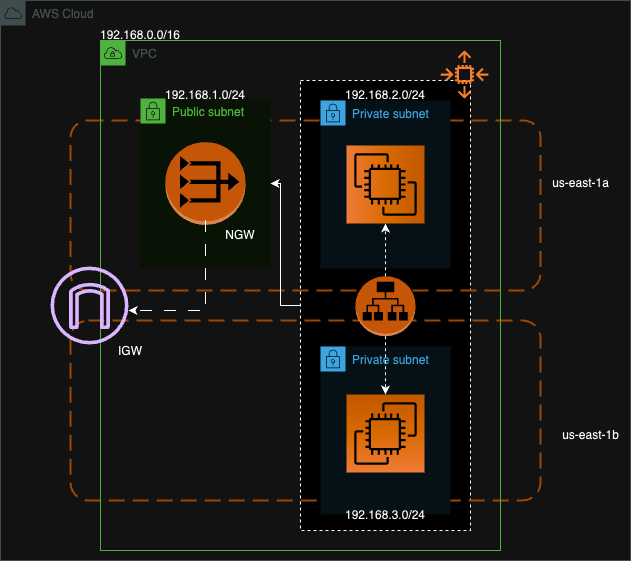
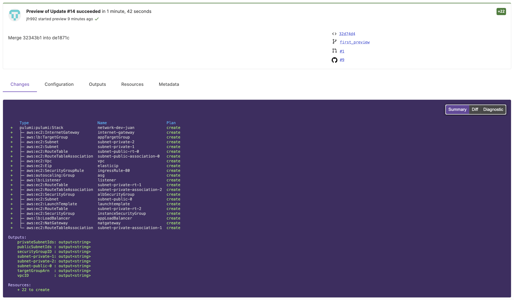

# Pulumi POC with GitHub Actions

## Description

This Pulumi project sets up a network, an Application Load Balancer (ALB), and an Auto Scaling Group (ASG) using custom Pulumi [packages](https://github.com/jfr992/pulumi-packages) developed for this project.  It has been designed with the concept of an Infrastructure as Code (IaC) library in mind, allowing developers to seamlessly integrate infrastructure provisioning alongside their applications. Developers can provide the infrastructure configuration in a YAML file (infra.yaml), which serves as the input for the project. The infrastructure creation can be orchestrated through a main.go (check this example) program, which calls the package containing different resources. It's intended that the infrastructure creation process occurs only once before deployment and testing, ensuring consistency and reproducibility. Check the architecture diagram below.

### Architecture of WebServer Deployment



## Project Structure

- **Network**: Creates a Virtual Private Cloud (VPC) along with public and private subnets.
- **ALB**: Creates an Application Load Balancer and a target group.
- **ASG**: Creates an Auto Scaling Group with instances that are registered to the target group.

### Prerequisites

Before running this project, ensure you have the following installed:

- [Go](https://golang.org/doc/install)
- [Pulumi](https://www.pulumi.com/docs/get-started/install/)

Make sure to follow the installation instructions provided in the documentation links for each prerequisite.

### Setting Up GitHub Secrets

To securely manage your AWS access keys and Pulumi access token, you can set them up as GitHub secrets:

1. **AWS Access Keys**: Generate an AWS access key ID and secret access key in the AWS IAM console. Then, go to your GitHub repository's settings, navigate to the "Secrets" section, and add these keys as secrets named `AWS_ACCESS_KEY_ID` and `AWS_SECRET_ACCESS_KEY`.

2. **Pulumi Access Token**: Generate a Pulumi access token in the Pulumi console by navigating to **Settings** > **Access Tokens** and clicking on **Create Access Token**. Once generated, add the token as a secret named `PULUMI_ACCESS_TOKEN` in your GitHub repository's settings.

By setting up these secrets, you can securely authenticate with AWS and Pulumi without exposing sensitive information in your codebase.

### Previewing Changes

You can preview the infrastructure changes both in the GitHub workflow and through the Pulumi UI.

#### GitHub Workflow

The GitHub Actions workflow (`pulumi-preview.yml`) is configured to provide a preview of the infrastructure changes whenever a pull request is opened.This allows you to review the proposed changes before they are applied.The (`pulumi-up.yml`) is configured to update the infrstruture after the pull request is merged and reviewed. Make sure to change stack-name under the pulumi actions with the name of your org/stack.

#### Pulumi UI

Additionally, you can visualize and review the infrastructure changes using the Pulumi UI. After running the preview command locally or in the GitHub workflow, navigate to the Pulumi UI dashboard. There, you'll find a detailed visualization of the proposed changes, including the resources to be created, updated, or deleted.



## Configuration

The infrastructure configuration is managed through the `infra.yaml` file, and the user data script for the ASG instances is provided in the `userdata.sh` file.

### `infra.yaml`

```yaml
vpc:
  name: vpc
  cidr_block: <vpc-cidr>

subnets:
  - cidr_block: <public-cidr>
    az: us-east-1a
    public: true

  - cidr_block: <private-cidr>
    az: us-east-1a
    public: false

  - cidr_block: <private-cidr>
    az: us-east-1b
    public: false

alb:
  port: 80
  allowed_cidrs:
    - 0.0.0.0/0

asg:
  name: "some-name"
  ami-id: "ami-123"
  instance-type: "t2.micro"
  min-size: 1
  max-size: 1
  desired-capacity: 1
  ports:
    - 80
```

### Running the Project Locally

1. Log in to the AWS console and create an IAM user with enough privileges.
2. Gather the `AWS_ACCESS_KEY_ID` and `AWS_SECRET_ACCESS_KEY` and set them as environment variables:

```sh
export AWS_ACCESS_KEY_ID="<AWS_ACCESS_KEY_ID>"
export AWS_SECRET_ACCESS_KEY="<AWS_SECRET_ACCESS_KEY>"
```

3. Clone the repository and navigate to the project directory:

```sh
git clone https://github.com/jfr992/pulumi-poc.git
cd pulumi-poc
```

4. Install dependencies:

```sh
go mod tidy
```

5. Deploy the infrastructure:

```sh
pulumi up
```

### Outputs

The following outputs will be exported:

- `vpcID`: The ID of the VPC created.
- `privateSubnetIds`: The IDs of the private subnets created.
- `publicSubnetIds`: The IDs of the public subnets created.
- `targetGroupArn`: The ARN of the target group created.
- `securityGroupID`: The ID of the security group created.


## Author

Juan Felipe Reyes Marlés